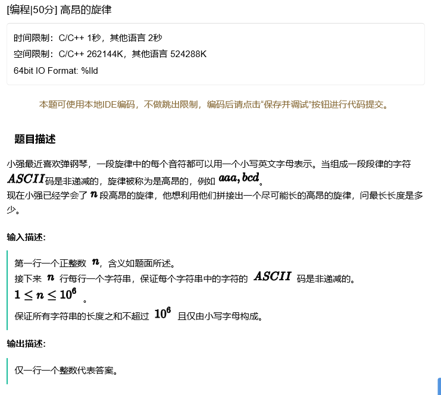
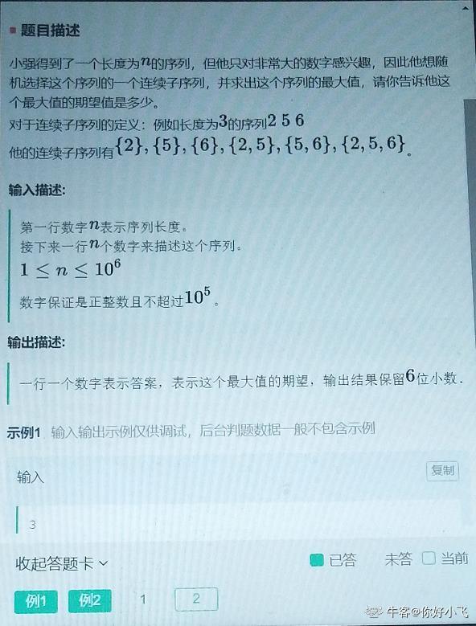

### 3.30阿里笔试第一题 & 3.20阿里笔试
听到同学跟我说这个题目简直捶胸顿足，跟上一场笔试比起来，这也太简单了吧第一题（不过上一场第一题好像也挺简单的，只是自己当时没接触过那个问题的本质而已）
&emsp;&emsp;不过不知道是不是阿里觉得上次的笔试比较难然后改变了一下题目的难度
#### 题目描述：
> 小明有n个养鸡场，每天开始每个养鸡场增加k只鸡，每天结束找出鸡最多的养鸡场卖掉一般（小数取整），m天后，小明所有养鸡场鸡的总和是多少？

简单建立一个最大堆来维护最大鸡数的鸡场，鸡场的数量可以看成为外部增加的鸡和基础鸡，第i天时，总数量T = 基础鸡B + i\*k，根据题意，每个鸡场增加的鸡数都是一样的，只要把i\*k只鸡都留在堆外用一个变量i表示第i天即可，则最大堆里面维护的是每个鸡场基础鸡数的堆排序，基础鸡数排序就等于鸡场的总鸡数排序。

```C++
int N, M, k;
priority_queue<int,vector<int>,less<int>> jichang;
int main(){
    cin >> N >> M >> k;
    for (int i = 0; i < N; ++i){
        int ji;
        cin >> ji;
        jichang.push(ji);
    }
    for (int i = 0; i < M; ++i){
        int jichu = jichang.top();
        jichang.pop();
        jichang.push((jichu + (i + 1) * k) / 2 - (i + 1) * k);
    }
    int res = 0;
    while(!jichang.empty()){
        res += jichang.top();
        jichang.pop();
    }
    return res + M * k * N;
}
```


### 3.20阿里笔试第一题
题目：
> 

本质上是一个0-1背包问题，一个字符串对应的决策只有拿和不拿两种选择，没有拿其中的部分这一说法；对应就是动态规划即可，将其抽象成背包问题，这里显然背包的大小为26，为26个字母序，每一个字符串能够被抽象成三个值,**(开始字符、结束字符、字符串长度)**，
**显然：**
* 字符串长度就是这个字符串的价值，
* 结束字符表示背包最少的大小才能够容纳，
* 开始字符表示容纳了该字符串之后还剩多少空间

dp最重要的就是转移的方程，（但是听着好像说的很玄乎，实际上就是递归的时候，递归的部分的逻辑）当遇上第i个字符串时，如果此时背包大小还能够放下该字符串的时候，产生决策分支，收和不收，在其中取一个最大值，即

    dp[i][j] = max(dp[i - 1][j], dp[i - 1][strings[i - 1].start] + strings[i-1].length);

这里```dp[i-1][j]```就代表着不放该字符串，还剩下j的空间去装剩下i-1个字符串能够得到的最大字符，而```dp[i - 1][strings[i - 1].start] + strings[i-1].length```表示放下该字符串，则背包中价值需要加上字符串的长度，剩余空间变为该字符串的起始字符代表的大小，strings是一个数组，存放着按照尾字符降序排列的输入字符串结构，结构如下
```C++
struct abstract{
    int start;//0-25
    int end;//0-25
    int length;
    abstract(int s, int e, int l) : start(s), end(e), length(l){}
};
```


**代码如下：**
```C++
int N;//总共有N个字符串
int **dp;
struct abstract{
    int start;//0-25
    int end;//0-25
    int length;
    abstract(int s, int e, int l) : start(s), end(e), length(l){}
};
struct comp{
    bool operator()(abstract a1, abstract a2){
        return a1.end < a2.end;
    }
};

vector<abstract> strings;
int main(){
    cin >> N;
    dp = new int *[N+1];
    for (int i = 0; i < N + 1; ++i){
        dp[i] = new int[26]();
    }//这里实际上包含了basecase部分，将i=0的数组都初始化成0，在new的过程中就自动执行了。
    for (int i = 0; i < N; ++i)
    {
        string temp;
        cin >> temp;
        strings.push_back(abstract{temp[0] - 'a', temp.back() - 'a', temp.size()});        
    }
    sort(strings.begin(), strings.end(),*(new comp));

    for (int i = 1; i < N + 1; ++i){
        for (int j = 0; j < 26; ++j){
            if(j >= strings[i-1].end)
                dp[i][j] = max(dp[i - 1][j], dp[i - 1][strings[i - 1].start] + strings[i-1].length);
            else dp[i][j] = dp[i-1][j];
        }
    }
    cout << dp[N][25];
    getchar();
    getchar();
}
```

### 3.30阿里笔试第二题
题目：
> 
简单想一想，最暴力的遍历方法是O(N^3)
好像能够想出来的最低时间复杂度就是O(N²)，估计去跑也会爆时间吧，暂时还没想出来时间复杂度更低的算法