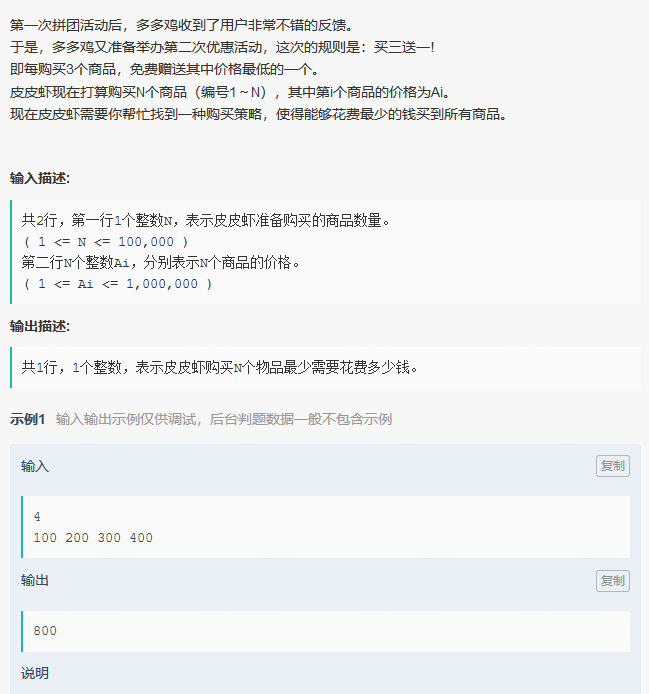
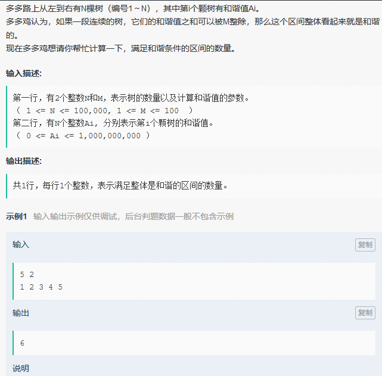

## 1. 

    int N;
    priority_queue<int, vector<int>, less<int>> que;
    long long res;
    int main(){

        cin >> N;
        while(N--){
            int temp = 0;
            cin >> temp;
            que.push(temp);
        }
        int count = 0;
        while(!que.empty()){
            long long price = que.top();
            que.pop();
            ++count;

            res += (count == 3 ? 0 : price);
            count %= 3;
        }
        cout << res << '\n';
    }

## 2. 

    int N,M;
    typedef int times;
    long long res = 0;
    unordered_map<int, times> modMap;
    int sum = 0;
    int main(){
        cin >> N >> M;
        while(N--){
            int Ai = 0;
            cin >> Ai;
            sum = (sum + Ai) % M;
            if(sum == 0)
                res += 1;
            res += modMap[sum];
            modMap[sum]++;
        }
        cout << res << '\n';
    }

