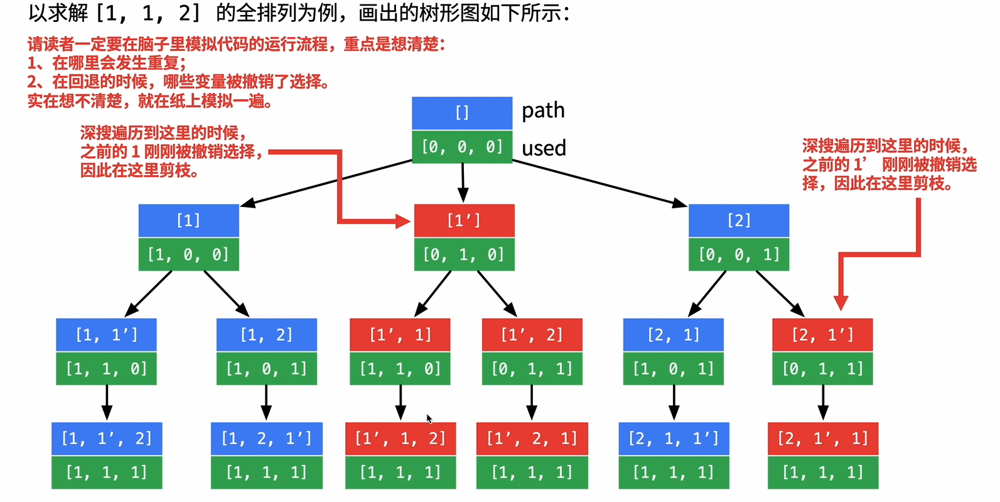

/*
 * @lc app=leetcode.cn id=47 lang=cpp
 *
 * [47] 全排列 II
 */
/*
```C++
*/
#include"all_include"
// @lc code=start
class Solution {
public:
    vector<vector<int>> permuteUnique(vector<int>& nums) {
        sort(nums.begin(), nums.end());

        used.resize(nums.size());
        for (int i = 0; i < used.size(); ++i){
            used[i] = false;
        }
        backtracking(nums, 0);
        return res;
    }
private:
    vector<vector<int>> res;
    vector<int> path;
    vector<bool> used;
    void backtracking(vector<int>& nums, int pos){
        if (pos == nums.size()) {
            res.push_back(path);
            return;
        }

        for (int i = 0; i < nums.size(); ++i){
            if (used[i])
                continue;
            if (i != 0 && nums[i] == nums[i-1] && used[i-1])
                break;
            path.push_back(nums[i]);
            used[i] = true;
            backtracking(nums, pos + 1);
            path.pop_back();
            used[i] = false;
        }
    }
};
// @lc code=end

/*题解注意点及知识点
```
 
上面为本解答代码的剪枝过程,下图为本解答代码中
```C++
if (i != 0 && nums[i] == nums[i-1] && used[i-1])
                break;
```
used[i-1]改成!used[i-1]的剪枝过程
由于是全排列,所以同一层来说,相同的元素只需要出现一次即可那么如何让相同的元素只出现一次呢?先来看本题题解代码:
``i != 0 && nums[i] == nums[i-1] && used[i-1]``说明在上一层,有一个出现在i-1位置的数,正在使用中,而且`i-1`位置数等于`i`位置的数,说明本次深搜,至少是由上一层i-1位置搜过来的,将所有相同出现的数,都交给最右边的这个数来进行深搜.
因为只要左边某一个相同的数先深搜,那么始终会在深搜过程中,这个数右边会出现一个`i`,`i != 0 && nums[i] == nums[i-1] && used[i-1]`
*/