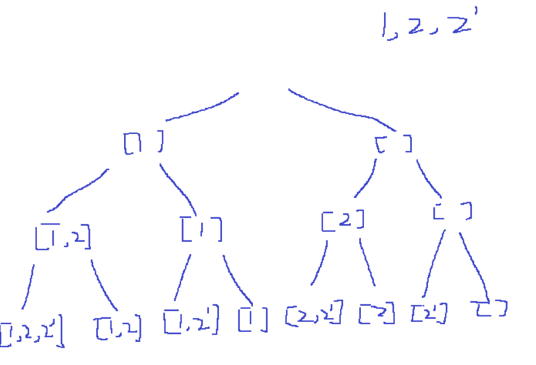

/*
 * @lc app=leetcode.cn id=90 lang=cpp
 *
 * [90] 子集 II
 */
/*
```C++
*/
#include"all_include"
// @lc code=start
class Solution {
public:
    vector<vector<int>> ans;
    vector<int> path;
    vector<bool> used;
    vector<vector<int>> subsetsWithDup(vector<int>& nums) {

        int n = nums.size();
        if (!n){
            return {{}};
        }
        sort(nums.begin(), nums.end());
        used.resize(n, false);
        dfs(0, nums);
        return ans;
    }
    void dfs(int pos, vector<int>& nums){

        if (pos == nums.size()){
            ans.push_back(path);
            return;
        }
        //先考虑用上这个数
        path.push_back(nums[pos]);
        used[pos] = true;
        dfs(pos + 1, nums);
        used[pos] = false;
        path.pop_back();

        if (pos != 0 && nums[pos]== nums[pos-1] && used[pos-1]){
            return;
        }
        dfs(pos + 1, nums);
    }
};
// @lc code=end

/*题解注意点及知识点
```
1. 首先想到的就是dfs的方式,但是会涉及到重复的问题,要么判重,要么在dfs中剪枝
首先查看不剪枝的遍历顺序:

出现的第一个重复集合`[1,2]` 和`[1,2']`,是因为`选中2而不选中2'`,和`不选中2选中2'`造成的
则我们可以规定一个方式,如果某个数之前出现过(即`nums[pos]== nums[pos-1]`),则我们只关注现在这个数选中的情况,(因为不这样就构成上面重复集合的出现条件.);
2. 其次就是数学上的排列组合问题.例如总共有1个1和2个2,那么1可以选择出现0次和1次,2可以选择出现0次,1次,2次,关键是如何根据这些排列去构造出对应的集合.
*/