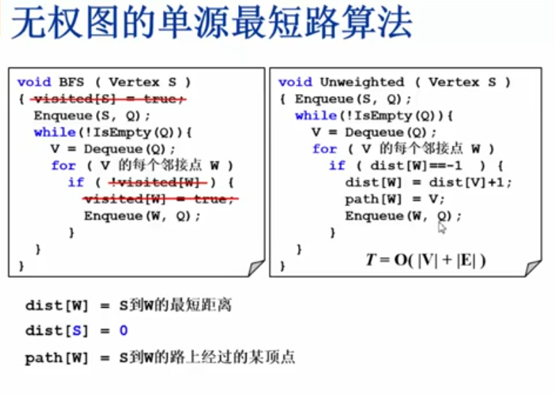
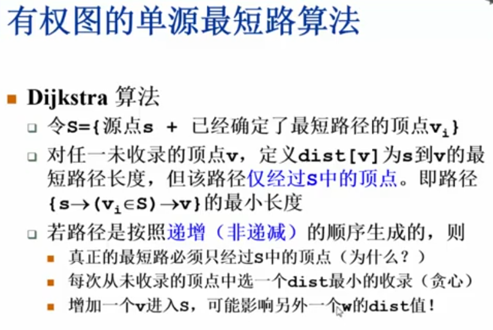

## （有向）无权图单源最短路径算法：

> 本身就是bfs搜索算法的变体，稍微进行改动一下即可，经过的最少节点数就是最短路径，无权图可以看成权重都是1的图。

## （有向）有权图单源最短路径算法：
dijkstra算法

## 拓扑排序
拓扑排序能够检查**有向图**中是否存在环
并查集能够检查**无向图**中是否存在环
一些要求:
1. 并查集在无向图中检查是否存在环:**边必须只出现过一次**,例如节点1和节点2相连,若用邻接矩阵表示,则应该只在M[2][1]或者在M[1][2]中出现过一次.(即单向查找)
2. **`dfs`** 也能够查找**有向图**中的环,即用三种状态标志节点,搜索中,未搜索和搜索完成,如果搜索途中遇到的新节点状态也为搜索中,则说明存在环.
3. **`bfs`** 查找**有向图**的换就直接看拓扑排序出来的节点的个数是否和总节点的个数相同.