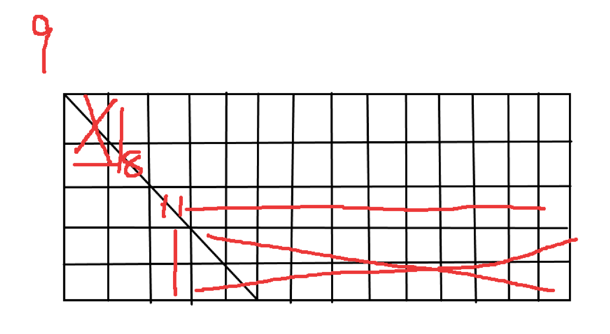

#### 题目描述
在一个二维数组中（每个一维数组的长度相同），每一行都按照从左到右递增的顺序排序，每一列都按照从上到下递增的顺序排序。请完成一个函数，输入这样的一个二维数组和一个整数，判断数组中是否含有该整数。

思路：
>1. 暴力破解就不说了，时间复杂度O(mn)

>2. 根据数组的规律来进行查找，i == j下标时候的数很特殊，其左上的数（包含左边和上边）都小于等于它，因此，可以采用分而治之的思想，如下图所示
  
假设我们要查找数字9，显然数字8左上的部分和数字11右下的部分不用去查找了，然后再在留下来的两个矩形中继续用分治的思想，**直到分到的矩形是单个格子或者单行单列**，这时候采用二分查找方式进行查找即可。

>3. 对每一行或者每一列进行二分查找，**复杂度是O(mlog(n))或者是O(nlog(m))**,当m和n接近时，两个方法的复杂度差不多，但是列特别长或者行特别长的情况下，判断一下m和n的大小，如果m远大于n，则取O(nlog(m))，反之则取O(mlog(n))的方式。

#### 分析：总体来说应该是第二种方法比较快吧。在m和n不差太多的情况下，能够达到O(log(mn))的时间复杂度。