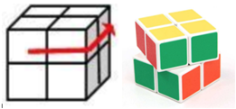
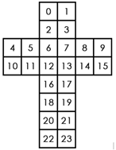

二阶魔方又叫小魔方，是2*2*2的立方形结构。每一面都有4个块，共有24个块。每次操作可以将任意一面逆时针或者顺时针旋转90°，如将上面逆时针旋转90°操作如下。  
  
Nero在小魔方上做了一些改动，用数字替换每个块上面的颜色，称之为数字魔方。魔方上每一面的优美度就是这个面上4个数字的乘积，而魔方的总优美度就是6个面优美度总和。
现在Nero有一个数字魔方，他想知道这个魔方在操作不超过5次的前提下能达到的最大优美度是多少。
魔方展开后每一块的序号如下图：
  
<B>输出描述：</b>
> 输出一行包含一个数字，表示最大优美度。  

<B>输入例子1：</b>
> 2 -3 -2 3 7 -6 -6 -7 9 -5 -9 -3 -2 1 4 -9 -1 -10 -5 -5 -10 -4 8 2

<B>输出例子1：</b>
> 8281

#### 解题思路：
可以采用搜索算法，bfs和dfs都可以，甚至递归