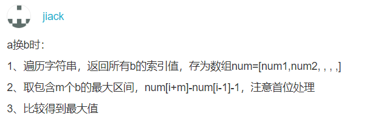

#### 题目描述
有一个仅包含’a’和’b’两种字符的字符串s，长度为n，每次操作可以把一个字符做一次转换（把一个’a’设置为’b’，或者把一个’b’置成’a’)；但是操作的次数有上限m，问在有限的操作数范围内，能够得到最大连续的相同字符的子串的长度是多少。
#### 输入描述:
>第一行两个整数 n , m (1<=m<=n<=50000)，第二行为长度为n且只包含’a’和’b’的字符串s。
#### 输出描述:
>输出在操作次数不超过 m 的情况下，能够得到的 最大连续 全’a’子串或全’b’子串的长度。
#### 示例1
>输入
>>8 1
>>aabaabaa 

> 输出
>>5  

>说明
>>把第一个 'b' 或者第二个 'b' 置成 'a'，可得到长度为 5 的全 'a' 子串。   

## 代码：
```c++
#include <iostream>
#include <queue>
using namespace std;
int max_substr(string & s,int n, int m, const char ch){
    queue<int> q;
    int left{0},right{0};
    int maxsize{m};
    while(right < s.size()){
        if(s[right] == ch) {
            ++right;
            maxsize = right - left > maxsize?right -left:maxsize;
        }
        else{
            q.push(right);
            if(q.size() > m){
                left = q.front() + 1;
                q.pop();
                ++right;
            }
            else{
                ++right;
                maxsize = right - left > maxsize?right -left:maxsize;
            }
        }
    }
    return maxsize;
}


int main(){
    int n{0},m{0};
    string s{""};
    cin >> n >> m >> s;
    int max_a = max_substr(s,n,m,'a');
    int max_b = max_substr(s,n,m,'b');
    return max_a>max_b?max_a:max_b;
    system("pause");
}
```
**后来看评论的时候，看到一个眼前一亮的思路，总觉得别人的思路总体上考虑的比我好，这里我的思路就是用一个滑动的窗口往后走，当里面包含的其他字符（就是说我们要转成a的时候，包含b）小于可以转换的次数的时候，窗口不断扩大，直到包含最大可转换次数个数的其他字符为止，然后这里main函数里面相当于调用两次这个函数但实际上时间复杂度依旧是O(n)这位仁兄思路如下：**  

