### 首先说一下感想：左神太强了吧，另外创造这些新算法的人也都太强了吧，膜拜真的。1.5倍速刷左神的课程实在是太舒服了，强推一下。
#### 1. **KMP算法**
> 是一种加速了的字符串比对的算法，利用了上一次比对的信息。传统的暴力算法的时间复杂度是O(n^2)是因为每次的比对都是独立的，相互之间没有关系&emsp;&emsp;&emsp;
> &emsp;&emsp;建立了一个最**长前后缀匹配**的概念，什么叫前缀和后缀呢？比如说"abc123abcdefgh"，d字符前的子串"abc123abc"，它的前缀就是不包含最后一个字符的从第一个字符开始的子串，例如"123a","123ab"都是前缀，空缀也是前缀的一种，后缀的话则是从尾字符开始不包含头字符的一个子串。
> &emsp;&emsp;在上面的例子中，的最长前后缀匹配数就是3，因为前边的abc和后边的abc匹配。那么这时候如果查找的str2（字符串2）假设是"abc123abcff"，当我们所有位的最长前后缀匹配信息建立之后（假设存在数组next中），匹配到第十个字符的时候，发现了错误，那么这时候就可以利用上述信息数组中存的信息，也就是3来表示，把str2的第一个a和str1中的第二个a对齐继续开始比对，而且这对其的abc我们是不用再次进行检验的。因为计算最长前后缀匹配的信息过程中已经存下来了。

&emsp;&emsp;**那么关键来了**：
&emsp;&emsp;**具体处理流程代码：**
```C++
int * generateNext(const char * array, int length){
    int *Next = new int[length]();
    Next[0] = -1;
    int k = -1, i = 1;
    while(i < length){//注意数组下标是从零开始的
        if(k == -1 || array[i] == array[k]){
            Next[i++] = ++k;
        }
        else{
            k = Next[k];
        }
    }
    return Next;
}
```
这里的k = Next[k]可以说是代码的精髓了，如果能够把这个理解了，那么就应该没问题了。
**题型的其他应用：** 判断一棵树是不是另一棵树的子结构，好像牛客网上的一题就是这个，先把一棵树用字符串的方法唯一的表示出来，方式就是在空的左右子树用#或者其他能够区别开来的标识进行替代，然后前序输出成字符串，接着把另一棵树做相同处理变成另一个字符串，判断后一个字符串是否是前一个字符串的子串即可。

#### 2. **马拉车算法**
经典问题：***最长回文子串***
&emsp;&emsp;首先这题还是存在暴力算法，在字符串的每一个位置上往两边扩展，如果回文子串比当前最大值还大，则更新当前最大值。
> 1. 暴力算法中的细节：奇数个字符的回文子串，从一个字符开始往两边扩展，但是偶数个字符的回文子串需要从两个字符进行扩展。
> 2. 还是由于上一次查找的信息没有存下来，这里依旧是一个空间换时间的方法。

算法**建立的概念：**
> 1. 回文半径数组，是一个额外信息的数组，每个位置都存了当前位置字符前的最长回文的半径。
> 2. 回文右边界，子串回文中达到的最右边界R
> 3. 回文右边界的中心C

在进行算法之前为了解决偶数串和奇数串的问题，往原始字符串中每隔一位加入一个分界符，例如@#$等，举个例子，原始计算字符串"abdefg"添加分界符之后变成"#a#b#c#d#e#f#g#,这样取最大的回文字符串个数/2即可。
一切准备就绪，就开始了。
> 这里我们**假设之前的各种信息都正确，位置已经走到了下标为i的字符**分为两大种情况：
> **1.** i下标字符在回文右边界之外，这时候已经存下来的信息没有用处，需要暴力往外扩，这时候会把回文右边界往右扩，同时需要更新回文右边界的中心。
> **2.** i下标字符在回文右边界之内，这时候需要查看i关于回文右边界中心C的对称点i'，
>> **2.1**如果i'对应的回文左边界在C对应的回文左边界内，根据推理可得i下标的最长回文数就是i'下标的最长回文数
>> **2.2**如果i'对应的回文左边界在C对应的回文左边界外，则根据推理可得i的最长回文半径为i本身到R
>> **2.3**如果i'对应的回文左边界在C对应的回文左边界上，即两个边界刚好相等，这时候在原来的基础上往外扩即可

> 返回的最大值/2即可得原先的字符串最大回文数组。
##### 对应例题
*给定一个字符串，在其末尾添加字符使其变为回文字符串，求需要添加的最少字符个数。* 
这题关键就是找包含了最后一个字符的最长回文序列，也就是当扩展字符串的R第一次达到最右边时，此时C下标对应的最长回文子串，由于是扩展字符串的长度，换算成原本字符串的回文长度需要/2，则还需要添加的最少字符即为原字符串的长度-包含末尾的最长回文子串的长度。
#### 3. **双端队列解决窗口中最值问题**
*这里先规定一下窗口的运动规律：窗口的左右边界都只能往右走，并且左边界不能大于右边界（可以等于，此时窗口中即为一个数）*
> 经典问题：***假设有一个数组array，有一个窗口从左往右滑动，请计算窗口滑动时候窗口内部的最大值。***

暴力解法依旧是O(n^2)的时间复杂度，因为对于每一个窗口都需要把窗口内的数遍历一遍，这里采用双端队列的方法进行存储每一步的信息。
* 双端队列的特性，两边都可以出队入队。

**流程：** (以最大值为例)
* 当窗口的右边界移动时，查看新加进来的数字是否不小于队尾元素，如果是，则从队尾弹出元素，继续比较，直到队空或者队尾元素大于新加进来的数字为止，此时再将新元素入队。
* 当窗口的左边界移动时候，如果新退出窗口的元素不等于队首元素的话则不进行任何操作，否则把队首元素弹出。

**任何时刻队首元素都是滑动窗口中的最大值**
* 第一个操作中为什么要弹出：*首先进队列的肯定比后进队列的更加靠近左边界，因此当之后有更大的数进入窗口时，先前比新进入的数还小的数就不可能再成为窗口中的最大值了，因此弹出。(也可以理解成为：存在于队列中的就是当前窗口的最大值或者将来能够成为最大值的)
* 第二个操作中，很显然新出窗口的数如果不是当前窗口最大值（队首元素）的话，则当前最大值依旧在窗口内，而且新出窗口的数必不是当前窗口最大值，所以出队也没关系

#### 4. **单调栈的应用**
> 解决左右两边离自己最近的比自己大或者比自己小的问题，关键看栈是从底往上递减还是从底往上递增。

#### 5. 荷兰国旗问题
其本质是partition算法变体
**二分partitio算法：**
> 对于一个数组，给定一个数num，把小于等于num的数都放在左边，把大于num的数都放在右边，假设左边界为L，右边界为R，定一个指针i从L遍历到R，再定一个x表示小于等于num的范围，初始为L-1，因为此时还没有开始partition，当i指针往右移动时，只要该数字小于等于num，则swap(array[++x],array[i++]);

**荷兰国旗问题**
> 跟上面的二分partition算法不同，要求小于num的数放在左边，等于num的数放在中间
> 同上，定义less = L - 1，more = R + 1，i下标从L开始，
* 如果array[i] == num，i++，
* 如果array[i] < num,swap(array[++less],array[i++]);
* 如果array[i] > num,swap(array[--more],array[i]),查看此时array[i]跟num的大小，如果等于sum，则++i，如果大于sum，继续swap(array[--more],array[i])，继续查看arra[i];
* 如果i和more撞上了则停止。


#### 5.5 topK问题,可以用荷兰国旗的变体:bfprt算法进行解决.当然partition算法也是可以的
> `partition`算法主要是有点随机,看数据的分布,运气不好可能会`O(N^2)`,但是`bpfrt`就是严格的`O(N)`;


#### 6. 二叉树的非递归遍历
> 1. 非递归前序遍历preOrder(Node * root)
>> * 利用一个节点类型的栈，当根节点不空时，先入栈。(可以优化成为节点指针类型的栈，指针就代表了这个节点)
>> * 当栈不空时，执行以下操作：
>> 弹出一个节点，打印当前节点(此处对节点的操作定义为打印),从右到左把子树压入栈。
> 2. 非递归中序遍历inOrder(Node * root)
>> * 同样利用一个节点类型的栈，或者节点指针类型的栈，将root赋值给head
>> * 当 **head不为空**并且**栈不空**的时候执行以下操作
>> 如果head不空，表明当前指向一个节点，压入head，head=head->left;
>> 如果head为空，（也就意味着栈不空，这说明某棵子树的左边已经全部压入栈中）这时候弹出一个节点赋值给head，打印节点并head=head->right回到循环的头部
> 3. 非递归后序遍历postOrder(Node * root)
>> * 利用两个栈，先利用一个栈进行前序遍历的镜像操作即：**前序的顺序是 根->右->左**，然后遍历的时候不要直接对弹出的节点进行打印，而是将它存入多使用的这个栈中，而达到把**根->右->左**的顺序逆序为**左->右->根**

#### 6.5 二叉树的moris遍历
&emsp;&emsp;普通的递归遍历或者非递归遍历的额外空间复杂度都是至少O(N)，其中N是树的结点个数，而moris遍历能够达到额外空间复杂度O(1)的程度。
&emsp;&emsp;主要是利用了二叉树本身的信息，例如叶子节点的空孩子指针。我们规定，
>* 当到达一个节点时，若该左子树的最右边界的next不是指向自己，则将其置为指向自己，然后节点往左划即node = node.left
>* 若该左子树的最右边界是指向自己，则将其置为空，然后node = node.right
>* 若没有左子树，则直接node = node.right


#### 7. 二叉树的序列化和反序列化
&emsp;&emsp;将树结构变化成为字符串保存到文件中，而将树结构的文件重建成为树就称为反序列化（树本身是存在于内存中的，关机之后即被销毁）
这里倒是利用了递归的方式进行序列化，同样序列化也可以采用前序后序和中序三种，以前序为例表明序列化流程：
> 采用一个返回string的递归函数，传入参数为节点的指针，函数形如：**string seqPreOrder(treeNode * root)**
> * 递归返回条件：如果root为空则返回空子树占位符和节点间分隔符，只要能和节点value区分开即可。例如“空”采用占位符#，节点间分隔符采用"\_"，则空树返回"#\_",否则返回返回当前节点value值的字符串形式和左右子树的返回字符串之和，左右子树的返回字符串则通过递归调用当前函数进行获得。

**反序列化：**
> * 先把原字符串按照分隔符进行分割然后压入队列，然后调用构建树函数进行构建，返回一个指针指向头结点，把全局的队列作为引用传入
> * 然后把该不断从队列里弹出字符串，如果字符串等于"#",则直接返回NULL;否则就把字符串转化成节点值的类型新建一个节点，左子树的值等于继续调用该函数返回的值，右子树的值等于继续调用该函数返回的值。

***平衡二叉树的概念复习：左右子树都是平衡二叉树，并且左右子树的高度差不超过1，规定空树是平衡二叉树***
> 判断一棵树是否是平衡二叉树：
> * 采用递归，一个函数传入头结点，递归结束条件：当头结点为空时，返回树的高度0，当头结点非空，调用自身求左子树hl和右子树hr的高度，如果有-1出现则表示左右子树中有非平衡二叉树打破平衡则返回-1，否则继续判断两棵树的高度差，如果高度差大于1，返回-1，否则返回子树中高度较高的值+1；
> * 非递归：

***搜索二叉树的概念复习：左子树都比节点小，右子树都比节点大的树***
> 搜索二叉树的特性：中序遍历是依次升序的，利用非递归的中序遍历然后查看是否升序

***完全二叉树的概念复习：类似于数组直接构成的树***
> 判断一个节点是否是完全二叉树：
> * 利用层序遍历，采用队列辅助结构，当遍历的时候，
当一个节点没左子树有右子树的时候，直接return false，
当一个节点只有左子树或者没有子树的时候，之后遍历到的节点必须都是叶节点

**如何求一颗完全二叉树的节点个数，并且复杂度小于O(N)**
&emsp;显然不能用遍历的方式，只能采用递归划分的方式，需要采用到满二叉树的知识
> **树的高度和满二叉树的节点个数**
> 满二叉树的节点个数等于2^H-1个
> * 先获得整棵树的高度H，然后看根节点右子树的最左边界是否达到了这个边界，是的话则说明左子树是一颗高度为H-1的满二叉树，而右边则是另一颗完全二叉树又可以调用一次自身函数。

#### 8 字符串的前缀树trie树？
首先同样是一个树的结构，例如"abc"字符串，给定一个前缀树的空节点（或者叫头结点），然后这时候没有名字为'a'的路，新建一条道路'a'，到达一个新节点，然后从这个节点继续出发，找有没有一个名为'b'的树，如果没有则新建一条道路'b'，接着往下走，依次类推，直到走到数组最后为止。这个结构可以用来查找是否加入某个字符串，字符串的最长前缀是什么。**添加一些数据项例如path和end值，分别表示经过这个点的次数和最终到达这个点的次数，能够查询某个字符串插入了几次，以某个字符串为前缀的词有几个（包含它自身）**

#### 9 贪心策略
&emsp;&emsp;证明过程不用纠结，采用对数器进行对算法的验证
&emsp;**贪心算法常用的场合：图的最小生成树、所有字符串拼接（本质上可以归纳成为最小生成树）**_贪心的本质：设定一个优先级，把所有的对象都按照优先级排序然后进行执行_
1. ***例题***：_题目给了很多字符串，需要把它们全部拼接起来，需要拼接起来之后的长字符串字典序最小_
> 其本质是一个排序问题，按照一定的规则排序就可以获得字典序最小的长字符串，**排序规则**：两个字符串str1和str2，如果str1+str2的字典序小于str2+str1的字典序，则str1排在str2之前。**排序规则需要满足传递性**_例如按照上述规则，假设str1\<str2，str2\<str3,则str1按照上述规则也需要满足\<str3

2. ***例题：*** _切割金条，一条金条切成两半，需要花费和金条长度相同的硬币，现给你一个数组，数组的个数代表一条金条需要分成几块，每个数的大小代表每一块的大小，请求出一整块金条分给成给定结果花费最少的硬币_
&emsp;&emsp;这是经典的哈夫曼编码问题，借助最小堆的结构可以很容易地解决。先将原来数组构建小根堆，当堆大小≥2时，不断取出两个，然后相加把结果丢进去，到最后剩下的一个数即为最小代价。

&emsp;&emsp;***根据不同的比较重载，可以实现不同的堆***

    题目描述：
    假设 LeetCode 即将开始其 IPO。为了以更高的价格将股票卖给风险投资公司，LeetCode希望在 IPO 之前开展一些项目以增加其资本。 由于资源有限，它只能在 IPO 之前完成最多 k个不同的项目。帮助 LeetCode 设计完成最多 k 个不同项目后得到最大总资本的方式。
    给定若干个项目。对于每个项目 i，它都有一个纯利润 Pi，并且需要最小的资本 Ci 来启动相应的项目。最初，你有 W 资本。当你完成一个项目时，你将获得纯利润，且利润将被添加到你的总资本中。

    总而言之，从给定项目中选择最多 k 个不同项目的列表，以最大化最终资本，并输出最终可获得的最多资本。

    示例 1:

        输入: k=2, W=0, Profits=[1,2,3], Capital=[0,1,1].

        输出: 4

    解释:
        由于你的初始资本为 0，你尽可以从 0 号项目开始。
        在完成后，你将获得 1 的利润，你的总资本将变为 1。
        由于你最多可以选择两个项目，所以你需要完成 2 号项目以获得最大的资本。
        因此，输出最后最大化的资本，为 0 + 1 + 3 = 4。
&emsp;**看到这里的时候我都惊了知道吗，3月中，刚好做完字节的笔试，里面有一道题就是沙漠取水问题，简直就是一模一样，只能感叹，没有早一点看到左神的算法课，真是损失了一个亿**
&emsp;根据输入创建项目结构体，包含 **需要的资本**和 **能够收获的利润**两项，然后根据其需要的资本建立一个最小堆，接着不断从堆中弹出**所需资本≤当前所有资本**的项目，将其投入一个最大堆中，然后取出最大堆的堆顶，进行项目的运行之后（就是把该项目利润加入所有资本中），继续抛回最大堆，不断重复上述操作，直到第k步停止或者最大堆里面没有可以操作的项目为止。
&emsp;**沙漠取水问题就是在此基础上做一些修改，例如水站只能进入一次**
3. ***例题***

&emsp;*还是一个贪心算法的问题，但是如何贪则是需要考虑的地方，不能根据宣讲会的长短进行谈心，而是应该选用结束时间最早的进行排序。*
&emsp;&emsp;当一个问题贪能举出反例的时候，就说明这种贪的方法是错误的，应该适当调整，根据对象的特性以及所求问题的特性进行分析规划，这一点还是要好好训练


！！！！！！！！！！**上周的阿里题目，收到这个会议室安排的启发，突然有思路了，左神真的牛皮啊**(但是好像，不太一样，那个是最长，这个是最多，再好好思考思考)
<br></br>

#### 10. 从暴力递归到动态规划

***不需要死记硬背，关键是理解，李姐、李洁***
* ***汉诺塔问题***（这里就不解释汉诺塔游戏了）
汉诺塔总共有三个杆子，分别叫做from，to和help三根
主要分解流程如下：（假设当前有N个塔盘）
> 先把from杆子上的N-1个盘移动到help之上，然后第N个移动到to之上，接着把help之上的N-1个移动到to之上即可，**这样一个N塔盘的问题就转化成为了N-1个塔盘从help杆子移动到to杆子的问题（因为最大的盘已经放在了最底下所以这时候不会产生任何影响）**则N-1个塔盘的from为原来的help，to仍然为原来的to，而help就是原来的from。递归流程如下：


***递归主要的过程就是把问题的规模给减少，然后规定一个基础的问题规模，只要没达到基础规模就把问题继续划分为更少规模的问题抛给自身递归函数进行解决。*** **还有一个就是需要能够把问题抽象出来**

* **母牛生小牛问题：**
描述：
> 给定一只母牛，每年能够生一只母牛，生下的母牛三年后会成熟也会每年生一只母牛，求问N年后一共有多少只母牛？
>> n年时母牛的数量等于n-1年时母牛的数量+n-3年前母牛生下来的小牛的数量

**递归改动态规划适用的类型：** 有许多的重复计算，并且改点的值，跟之后的路径关系是无关的 ***例如矩阵中左上角到达右下角的最短路径之和（经过的数值之和）*** ：在(1, 1)下标的点，无论是如何到达该点的，都不会影响这点到终点的最短路径。
> 以上题为例，做出动态规划的具体步骤：
>* 确定要 求得结果的的最后位置*这里也就是（0,0）点到终点的最短路径*，那么从哪里开始进行规划呢，也就是不依赖任何其他状况的点，这里也就是终点的值是始终不变的，然后根据已知的情况往上一步进行规划，也就是终点上方和终点左方到终点的最短路径。然后继续规划，但是这么搞有点乱，可以先把最后一行和最后一列的最短路径直接求出来（因为在最后行或者最后列的时候行走方式只有一种）**(满足无后效性条件：该步之前的行为不会对该步之后的结果产生影响)**
* **数组求和问题：**
描述：
> 给定一个数组都是正数，给定一个数sum，数组中是否存在若干个数和为sum，若存在返回true，若不存在返回false

*递归版本：* 每到当前位置都做一次决策，要当前位置的数和不要当前位置的数，把这一步的累加和和下一个位置继续传进去递归
```C++
bool isSum(vector<int>& array, int index, int sum, int aim){
    if(index == array.size()) return sum == aim;
    return isSum(array, index + 1, sum, aim) || isSum(array, index + 1, sum + array[index], aim);
    //这里的index == array.size()需要稍微注意下。
}
int main(){
    vecotr<int> array{1,2,5};
    cout << isSum(array, 0, 0, 7);
}
```
这里的可变参数为两个，index和sum两个，因此需要建立二维的dp数组，根据index和sum的变化范围划定数组大小，显然index的变化范围就是0~array.size();这里根据题意，sum可能的变化范围为0~数组中所有整数的和(记做totalSum)，因此建立array.size()*totalSum 的数组，然后我们要求的(即main程序里要输出的最后结果就是0,0位置的)，根据basecase，可以填满index == array.size()这一行，即index == 3这一行如下图

接着根据递归的规则把每一行都填满，得到最后结果：

上图可得最后的结果是0,0位置的true，则最后输出结果应该也是true

### 11. 大楼轮廓问题
&emsp;&emsp;水平面上有 N 座大楼，每座大楼都是矩阵的形状，可以用一个三元组表示 (start, end, height)，分别代表其在x轴上的起点，终点和高度。大楼之间从远处看可能会重叠，求出 N 座大楼的外轮廓线。
&emsp;&emsp;外轮廓线的表示方法为若干三元组，每个三元组包含三个数字 (start, end, height)，代表这段轮廓的起始位置，终止位置和高度。

#### 样例
给出三座大楼：
``` C++
[ [1, 3, 3], [2, 4, 4], [5, 6, 1] ]
```
外轮廓线为：
```C++
[ [1, 2, 3], [2, 4, 4], [5, 6, 1] ]
```
#### 解题思路：
> 每一幢大楼都包含了三个信息，**起始坐标、结束坐标和高度**
> 廓线的产生是由于**大楼最高高度**发生改变引起的，那么产生**大楼最高高度**变化的原因就是，
>* 有新的大楼产生，该信息包含在信息的起始坐标中
>* 最高大楼结束，该信息包含在信息的结束坐标中

> 但是无论如何都是和大楼高度结合在一起的，首先将给出的信息，按照 \[ [坐标、高度、是否起始]\] 来切分，题目给出n个大楼信息则可以切分出n*2个信息。将这些信息，按照坐标进行升序排列，然后不断进行遍历

* 然后采用两个辅助**Map**
>* **Map1** *（key，value）对为（高度，该高度出现的次数）* 上述的拆分信息数组排序过后，按照是否起始进行数值的插入：
&emsp;&emsp;如果遍历到的信息是 *[坐标、高度、起始]* 则把其按照高度值插入Map，
&emsp;&emsp;如果遍历到的信息是 *[坐标、高度、非起始]*，则在map中找到对应的key，把它的value-1,如果减为零则把该value抹去
&emsp;&emsp;如果此时Map的最大值发生变化（用一个变量存储，最值发生变化包括从空树到不空，或者从不空到空）则此时将最值和对应的坐标存储进队列。
> * **队列** 不断弹出，当上一个的最高高度为零则不进行轮廓线打印，例如上个弹出的信息为(3,1)下一个信息为(4,2)则说明，从1到2的时候最大高度从3变成了4，则输出廓线(1,2,3).

### 12. 累加和最长子数组
> 给出一个数组array，求其中子数组之和为target的子数组的最长长度。

&emsp;是一道动态规划的问题，分别求出i = 0~size-1为数组最后元素时子数组之和为target的最大长度，然后取最大值即可。
&emsp;若要求某个i下标为数组最后元素的时候子数组之和为target的最大长度，只需要求出，最先出现sum-target累加和的下标即可。从i = 0不断往后退，规定最早出现累加和为零的时候的下标为-1；
> 例如数组【3,2,1,1,6,7】，求累加和为7的最长子数组的长度。

建立（sum，index）的map，并且插入（0，-1），此时子数组最长长度设置为-1；
> * 从i=0开始计算，加到i = 0下标的sum为3，只需要求出从零开始累加和为sum-target = -4最早出现的下标，map中无此记录，则说明i = 0之前的子数组无法加出7，此时出现累加和sum=3，为第一次出现，map中插入（3,0），
>* i = 1时，此时累加和sum = 5，只需要找到累加和为-2第一次出现的下标即可，未找到说明不存在，则说明i=1及之前的子数组无法累加出7，同时第一次出现累加和5，map中插入（5,1）
>* i = 2，sum = 6，找累加和为1第一次出现，找不到，则map插入（6,2）
>* i = 3，sum = 7，找累加和为0第一次出现，为-1，则-1之后到i累加能够成7，更新最大长度为4，map中插入（7,1）
>* i = 4，sum = 13，找累加和为-6第一次出现的位置，没有，则map插入（13,4）
>* i = 5，sum = 20，找累加和为-13第一次出现的位置，没有，则map插入（20,5）
最后返回子数组最长长度4；


#### 12.1 变体
* 在一个数组中，求奇数个数等于偶数个数的最长子数组长度
>* 如果可以修改数组中元素的话，先遍历一遍，把奇数都改成1，偶数都改成-1，那么就转化成为上述求target = 0 的问题。
>* 如果不能修改数组中的元素，则新建一个数组拷贝过来。

### 13 二叉树套路(多叉树也适用)树形DP
> **核心套路：** 从子辈获取信息，当成是黑盒过程，就假定可以得到这个结果，然后根据子辈的信息，结合自身的信息，提取出本身需要传递给父辈的信息进行传递。
**相关问题** ：
> **1.** 一棵树的最大二叉搜索树，
可能性为：
> 1. 最大二叉树在左边，
> 2. 最大二叉树在右边，
> 3. 最大二叉树就是这棵树（左边最大值小于节点值、右边最小值大于节点值，左搜索树头结点为节点左子树，右搜索树头结点为节点右子树，
> **返回信息为：**
> * 该棵树的最大值最小值、该棵树的最大二叉搜索树的大小，最大二叉搜索树的头结点。

> **2.** 树上最远距离，
可能性为：
> 1. 最远距离在左子树
> 2. 最远距离在右子树
> 3. 最远距离为左右子树深度之和加1
> **返回信息为：**
> * 该树的深度、该树的最大距离

> **3.** 员工排队活跃度最大问题（多叉树）
*规则：* 每一个人都是一个节点，公司上下级关系为严格的树形关系，每个人都有其活跃值。当一个人的上级参加派对时，该人肯定不来，而该人上级不参加派对时，来不来取决于你是否给他发邀请函，而你的任务就是保证派对的活跃度最大
&emsp;当处理一个节点时，*如果该节点来，* 则直接下级肯定不来，那么该节点来的时候最大活跃度就是直接下级不来时所有活跃度之和。
*如果该节点不来*则此时该树最大活跃度就是当个下级来或不来活跃度取较大值，然后将所有下级的结果返回。

> **4.** 判断一棵树是否是平衡二叉树
平衡二叉树概念：所有子树的左右子树高度差不超过1； 

**本质就是递归，设定一个basecase，然后将处理过程抽象成黑盒获得子辈的结果，将结果结合本身节点处理成要返回上级的信息返回，需要思考返回数据的结构。**

### 14. 设计可以改变的缓存结构（LRU）（The Least Recently Used）
 **太强了吧 左神，tnd真的牛批脑回路** 
 假设需要存储的东西为struct save，建立一个双向链表和map<value,Node*>，其中链表的尾部表明是最新的最常被使用的
 * 插入一个值：在map建立<value,Node*>记录，然后把结果串到链表的尾部。
 * 查询一个值，如果map中有，则将其挂到尾部，如果其是头，则头往后移动一格（即头指针做相应的调整）
 * 在缓存满的结构下再插入一个新值：首先把头部指针往后移动，然后原头部元素在map中的记录删除，接着把新元素记录插入map，然后节点挂在尾部。

 ### 14.5 设计可以改变的缓存结构（LFU）（Least Frequently Used）
 建立一个大的双向链表，然后将不同使用频率的节点挂在大链表之下，如下图：
 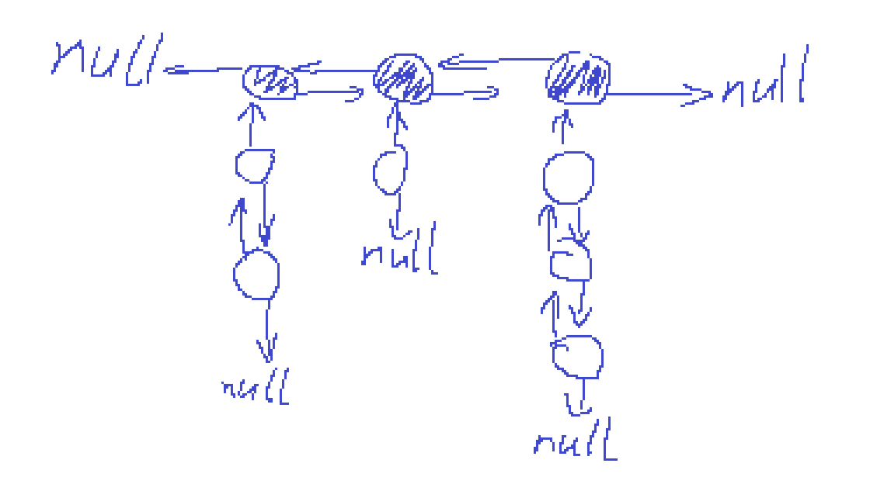
 然后建立两个Map，一个是```<key, Node*>``` 一个是```<Node*, ListNode*>```
 Node就是下面挂着的节点类型，有双向指针，以及对应的```key```，还有```times```即被调用的次数
 上面描黑的节点就是```ListNode*```只包含着双向指针以及指向下挂的第一个Node节点的指针（图中未画出），还有一些需要注意的调整细节：
 >* 当一个ListNode下没有东西之后，这个节点需要被移除，不能空放着（因为```ListNode```中没有存被调用的次数，如果不移除的话，可能随着调用删除次数增大而导致这种空节点越来越多）


 ### 15. 公式字符串返回计算结果问题
 左神不愧是递归小王子，哈哈哈不是白叫的.
 * 普通思路
> 首先按照普通的栈也是可以的,初始化读入一个数压栈,然后读入一个操作符和一个数,
> * 如果是乘除就把上一个数弹出计算结果然后把结果压栈
>* 如果是加减就压栈不管
>
> 碰到括号处理:
>* 如果是左括号,压栈
>* 如果是右括号,把边弹出边计算边压回结果,直到弹出碰到的一个左括号为止.
>
> 如果到了字符串的尾部,则将栈弹出计算并取最后的结果即可.
> **这样的问题:** 问题就是,这样都写在有一个函数中,需要扣较多的边界条件,比如读一个操作符一个数的时候,读到了括号怎么办、要压入栈的第一个数是负数怎么办...

* 递归思路
> 将括号中的计算简化成一个黑盒,碰到左括号,则调用递归过程,返回一个对应括号中的值以及我需要下一个开始计算的点即可.


 ### 16. 跳表
 存的也是value,对于每个要存入的value值,先计算层数
 > 规定某个概率p进行随机的结果是0,1-p概率的结果是1,进行随机选取,直到第一次随机到1的总共随机次数就是这个值的层数,显然层数越高的可能性指数下降的.
 > &emsp;系统头表的层数一定是存的值对应层数里面最大的.(如果有一个新的数层数比系统头表的层数还大,则需要扩充系统的头表的层数)
 > 如下图表示,假设某次插入操作前的结构图如下图所示
 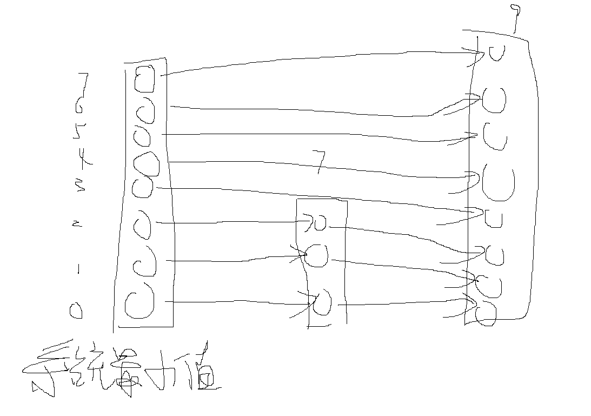
 我们规定从最头节点的最高层进行操作,一直到最底层为止.
 **对应每一层操作:**(如果当前层数比插入值层数要大,则直接往下走)
 > * 如果该层下一节点比当前插入值要小,(包含了两个信息,1.下个节点有值,2.下个节点的值比插入值要小)则跳到该层下一个节点,
 > * 否则直接在该节点后插入对应的值节点.然后继续解决下一层.
>
>以上图为例,假设要插入一个层数为5的8,
>* 首先会到系统头表的第4层(从0开始),然后发现下一个是9比8大,则在0和9之间插入一个8,
>* 然后到第3层的0,发现还是9,继续0和9之间插入一个8,
>* 接着第2层发现是7,跳到7,后面是9,则在第2层的7和9之间插入一个8,
>* 因为上一层在7,则现在跳到第1层的7,在79之间插入8,往下跳
>* 第0还是在79之间插入8,最后的结果如下图所示>>
 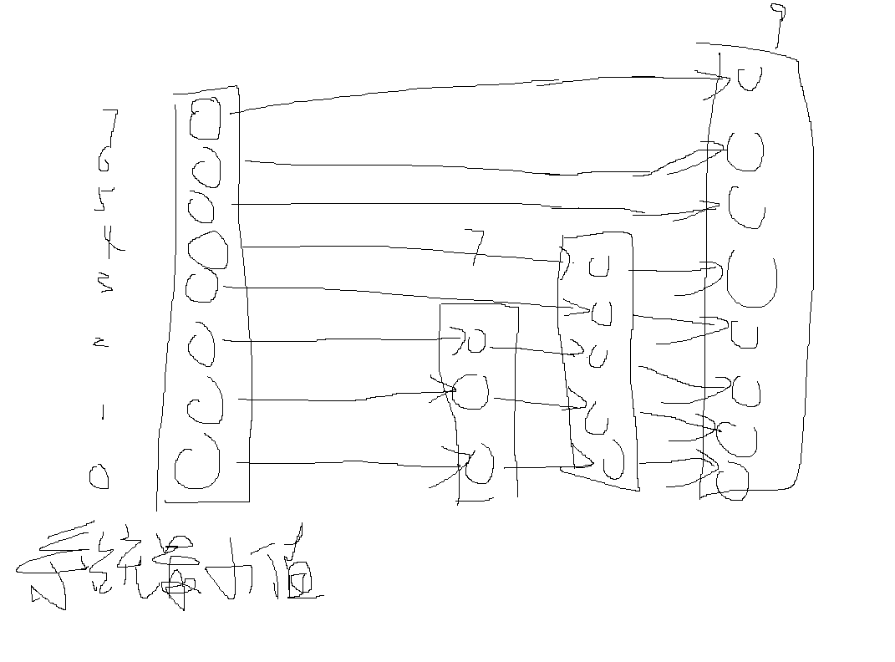

 * 跳表的关键就是利用概率使得越高层的数越少,在查找时从高层进入查找,跨度就可以达到十分大,假设有N个数,则最底层肯定有N个数,第1层有N/2个,第i层有N/(2^i)个,类似于二分查找,能够达到O(logN)的时间复杂度.

### 17. 最大异或和子数组
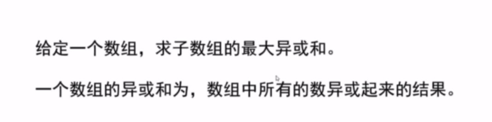
> 首先还是所有可能的子数组的拆分问题,一个数组的所有可能子数组等于每个以i(0~N-1)位置结尾的子数组的所有集合.例如数组[0,1,2,3]的所有子数组的集合可以分成
> * 所有以0为结尾的子数组[0]
> * 所有以1为结尾的子数组[0,1] [1]
> * 所有以2为结尾的子数组[0,1,2] [1,2],[2]
> * 所有以3为结尾的子数组[0,1,2,3] [1,2,3],[2,3]

1. 暴力解法:以上述拆分方法找出每个可能的子数组求出异或和并保存最大值.
```C++
    int res = INT_MIN;
    for(int i = 0; i < nums.size(); ++i){
        for(int start = 0; start <= i; ++start){
            int curSum = 0;
            for(int k = start; k <= i; ++k){
                curSum ^= nums[k];
            }
            res = max(res, curSum);
        }
    }
    return res;
```
2. 利用之前出现的信息减少重复计算.
如果要计算[k,i]的异或和结果,可以变为[0,i]的异或结果异或[0-k-1]的异或结果.**(首先满足异或的结合律)**
```C++
    int res = INT_MIN;
    int *dp = new int[nums.size()];
    int Eor = 0;//用于表示从0异或到i的异或和
    for(int i = 0; i < nums.size(); ++i){
        Eor ^=nums[i];//表示从0异或到i的异或和
        res = max(res,Eor);
        for(int start = 1; start <= i; ++start){

            int curEor = Eor ^ dp[start - 1];
            res = max(res,curEor);
        }
        dp[i] = Eor;//别忘记记录当前位置的结果
    }
    return res;
```
3. 升级版,只要O(N)的时间复杂度
前缀树加速过程
> 当我们说前缀树之前,先看看第二点是如何加速的,当我们计算以i为最后位置的所有子数组时,最初始的版本是start从0到i变化,内部再嵌套一个循环,把start到i之间的数全都异或得到子数组异或结果.第二点实现是利用了之前计算的信息进行存储,利用空间换时间.
> 而第三点加速的过程为:
>* 当计算第i个位置为结尾的所有子数组最大异或和,我们假定有一个黑盒已经把从0到0~i-1位置的所有异或和```(即E(0,0),E(0,1)...)```放进去了,
&emsp;&emsp;*在第二点中,我们遍历了所有的存储的信息,得到最大的结果*,
&emsp;&emsp;*而在第三点中,我们将之前的所有信息存储为前缀树,将一个数表示成32位二进制的数,最高位为前,最低位为后,表示成前缀树*
>&emsp;**因此只需要用遍历一个结果的时间数量级即可得到以i为结束位置的**将原来的**O(N)缩小成O(1)**
>* 已知整数在计算机中的表示都是补码,首位都是符号位,不管是正数还是负数,除了符号位之外的所有位之和越大,表示这个数越大(当然比较是介于同符号之间,负数和正数只需要比较符号为即可)
>* 因此得到了从0到i的所有数的异或和Eor之后,只需要到前缀树中获得一个最大的结果即可,查询的策略为:
> **如果能把符号位异或成0,就选择能异或成0的,之后的31位只要能异或成1就异或成1,不能则异或成0,然后最大异或结果返回**,最后将i位置的Eor放入前缀树.

### 18. 递归改dp(又来一次,我觉得这个版块还挺好的)
递归改dp就是要先写出递归的尝试版本,然后根据套路转换成dp方式.
##### **18.1**
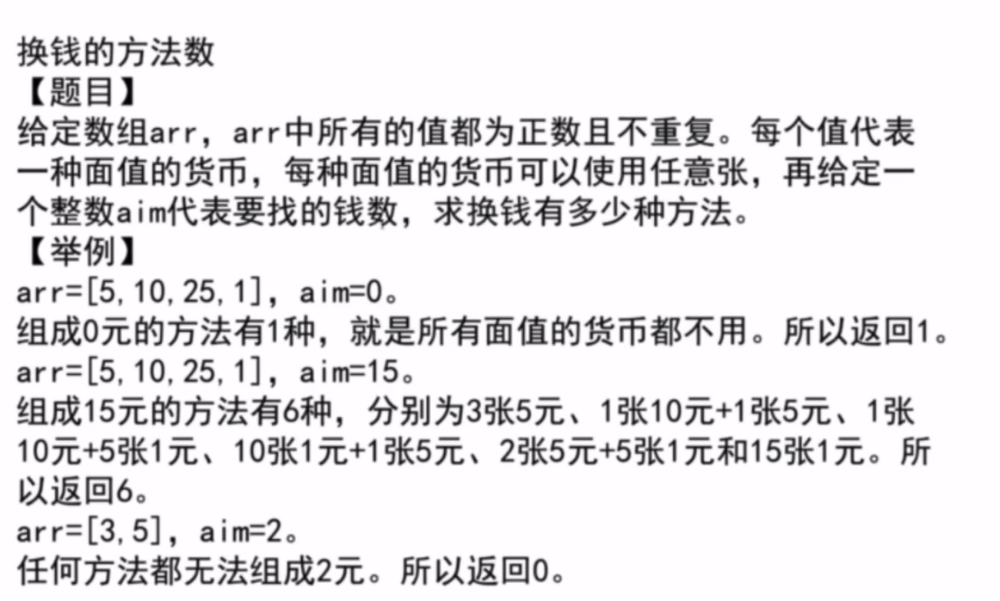
> 设计一个递归过程,当到第i种面额的纸币的时候,如果要凑出aim面额的金额,第i种面额的纸币可以选0~aim/arr[i]种,假设选k张,则剩余的面额aim-arr[i]*k需要从i+1及以后的面额纸币中凑出.
因此设计递归函数
```C++
    process(vector<int>& arr, int i, int aim)
    {
        int res = 0;
        if(i == arr.size()){
            res = aim == 0 ? 1 : 0;
        }else{
            for(int k = 0; arr[i]*k <= aim; ++k){
                res += process(arr, i + 1, aim - arr[i] * k);
            }
        }
        return res;
    }
```
> 这里可以看到每次改变的参数为i和aim两个,最初始传进去的i = 0,其变化范围为```0-arr.size()```;,传进去的另一个数为aim,变化范围为```0-最初要求的面额```
则设计一个二维数组dp,横坐标为i,纵坐标为aim,并且把basecase先初始化好这个数组,如下图所示:

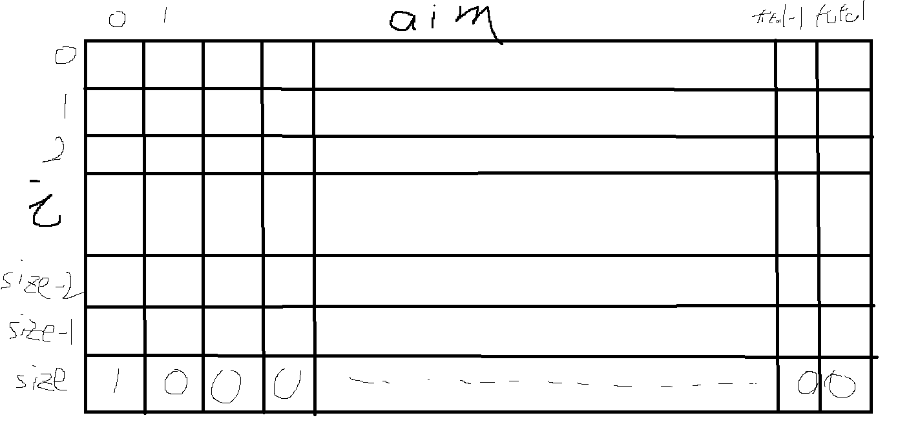
> basecase中,i = arr.size()的时候,如果aim = 0,res = 1,否则res = 0;
> 接着进行递归部分,在对应i = i, aim = aim的时候,
```
for(int k = 0; arr[i]*k <= aim; ++k){
    res += process(arr, i + 1, aim - arr[i] * k);
}
```
则对应的dp[i][aim] +=dp[i+1][aim - arr[i] * k];
最后的dp[0][total]就是最后的种数结果.
**另外的升级版** **滚动dp**,上图中我们可以看到,当计算i行的某个aim的时候,用到的是i+1行的数据,并且是```dp[i+1][aim]```之前的位置,这样我们可以只使用一行数组就可以完成整个过程,**当一个数组完成之后,下一个过程直接在原数组基础上从后往前覆盖即可**
****
##### **18.2**
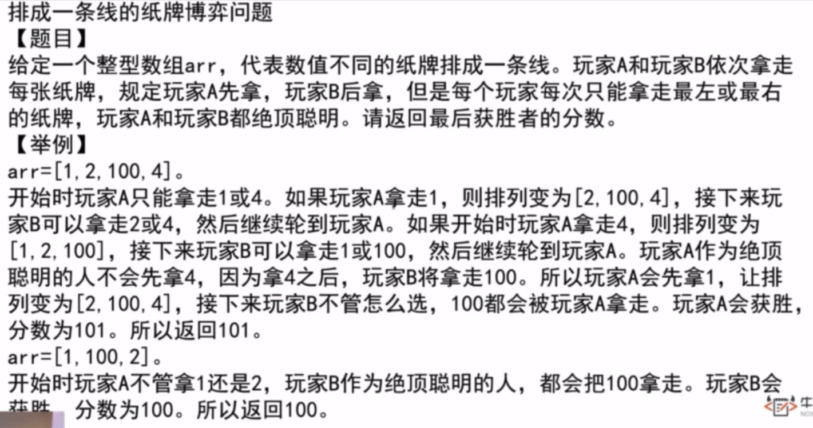
同样的,还是要首先写出尝试的版本.
# 左神经验,下面的字一定要放心里,牢牢记住
>> **当一个问题贪心无法贪出来的时候,就用暴力尝试,然后改成动态规划**
>> 可是就是尝试的部分很难啊思密达........

> **思路**把特殊情况转换成一般情况,对应i位置和j位置的一段数组,两个人分别先手和后手进行取牌,对于先手和后手都写一个递归函数(互相调用递归)
```C++
int f(vector<int>& nums, int i, int j){//先手函数
    if(i == j) return nums[i];//如果只有一个数,先手只能取这个数
    return max(nums[i] + s(nums, i + 1, j), nums[j] + s(nums, i, j -1));
    //先手必取i和j中的一个,取完之后对于剩下的段则变成了后手,所以后手的结果+取的这个数 的值有两种可能,取较大的.
}


int s(vector<int>& nums, int i, int j){//对于i和j后手能够取到的最大值
    if(i == j) return 0;//唯一的一个被先手的人取走了
    //下一步很关键!!!当我方为后手的时候,由于先手的人是绝对理智的,则会做出让后手的人拿到最少数的选择.
    //当先手的人取完了之后,我方就变成了(i+1,j)的先手或者(i,j-1)的先手,上一个人会让我们拿到的数尽可能小
    return min(f(nums, i + 1, j),f(nums, i, j-1));
}
```
有了递归改dp那就是很简单的事情了,不赘述,这里dp数组是两张表,而且每张表,正斜对角以下部分都是没有意义的

*****
******
##### **18.3**阿里某年真题
```假设有N个连续位置,从1到N,现在M位置上有个机器人,当机器人在1位置只能往右走,在N位置只能往左走,请问走P步之后停留在k位置的情况(或者说路径种数)有多少种```

首先抽象出最一般的情况,机器人当前位置在cur,还剩下rest步可以走,请问他能走到K位置还有几种方法,将这种一般情况写成递归状态:
```
int howManyPossible(int cur, int rest){
    int res = 0;
    if(rest == 0) res = cur == K ? 1 : 0;//如果剩下0步可以走,判断当前位置是否在K位置
    else{
        if(cur == 1) res += howManyPossible(2, rest - 1);//当前是否在1位置
        else if(cur == N) res == howManyPossible(N - 1, rest - 1);//当前是否在N位置
        else res += howManyPossible(cur - 1, rest - 1) + howManyPossible(cur + 1, rest - 1);//既不在1位置也不在N位置
    } 
}
```

dp也就不赘述了,普通二维数组dp比较简单,顶多加上一个数组滚动,但是看这个情形好像无法滚动
#### **18.4**运动的机器人升级版
假设有一条无限长的纸带,纸带上被分成了无限个大小相同的格子,机器人智能左右运动到相邻的格子里,并且运动到左边的概率和运动到右边的概率都是1/2,机器人到达过的地方格子都会被染红,请问机器人运动五百步之后,被染红的格子数的期望

### 19. sum<=target的最长子数组（全正数）
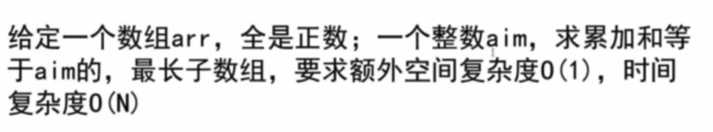
> 题目中给定了全都是正数这个一个限制,所以可以用O(1)的额外空间复杂度解决
>
*双指针方法*
> 给定一个左右指针,控制一个滑动窗口;设置一个变量sum记录窗口内数字之和.
>* 当数字之和大于target时,窗口左侧往右移动
>* 当数字之和小于target时,窗口右边界往右移动
>* 当数字之和等于target时,记录此时窗口大小,窗口右边界往右移动
### 20. sum<=k的最长子数组（任意数）
需要利用额外空间N来存储信息,两个长度为N的数组,分别叫做min_sum和min_sum_index,一个是存储 以该位置为起点,能够往后加到的最小**和**,另一个是以该位置为起点,加到最小值时的下标.
这个数组从后往前生成,利用已经生成的信息进行加速,举例子:
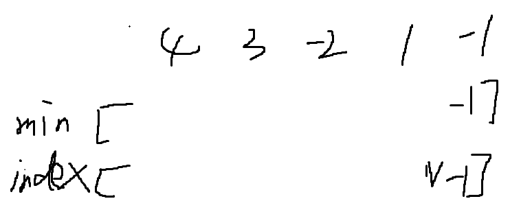-->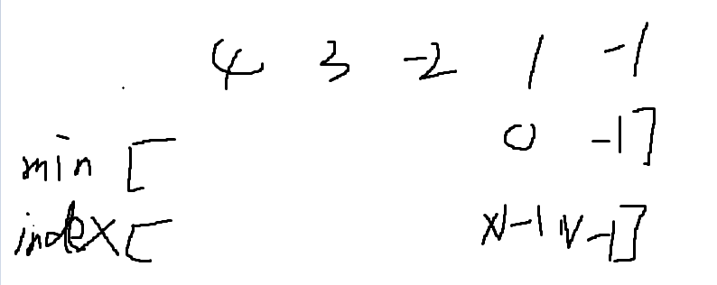-->
最后生成-->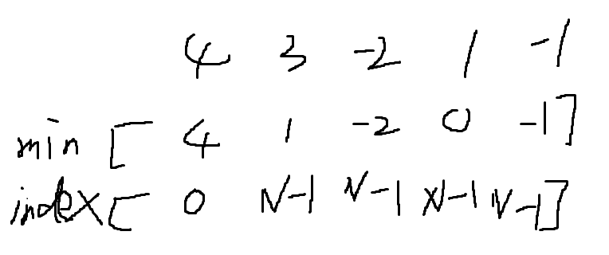
生成的逻辑为:只要上一个的值是小于等于零的就把上一个位置的min_sum加过来,然后index把上一个位置的index复制过来,否则min_sum就等于自身,index为自身位置下标.
**完成了这个信息数组之后进行双指针方法:**(突然发现,**子数组的情况双指针用到挺频繁的??**)
> 首先还是子数组拆分的问题,所有的子数组拆分成为,以每一个位置为开头的子数组的集合,例如下标从0到N-1的所有子数组可以拆分成为**所有以0为开头的子数组集合**+**所有以1为开头的子数组集合**+...+**所有以N-1为开头的子数组集合**
以 以零开头的子数组集合为例,双指针L = R = 0,sum = 0
接下来进入循环:
*当sum<=target时,一直尝试R往右扩,直到sum+min_sum[R]>target为止*
此时的R-L为 以0位置为开头小于等于k的最长子数组长度.
**接下来的其他位置不能如法炮制,不然无法达到O(N)的时间复杂度**
>> 接下来不需要从1开始重新尝试,只需要把0位置元素t出sum,即sum-=array[0],观察此时sum+min_sum <=target?,如果不满足,L继续加1,此时把i位置元素踢出,sum-=array[0];
***

### 21. 约瑟夫环问题：
**描述：n个人围成一个圈，任意指定一个数字m(m>=1),轮流进行报数，当数到m时，该人淘汰，下一个从从1继续开始报数，直到剩下最后一个人为止，请问这个人在原来的队列中的序号**  
**思路:** 当n个人中，第m个人被淘汰时，将下一个人的序号重新规定为1，就变成了n-1个人的约瑟夫环问题，可以用到递归。n个人时的胜者就是淘汰一个人之后剩下n-1个人之后的胜者，建立一个变化了之后的序号的对应，**seq(n) =(seq(n-1)+m)%n** ,递归的结束条件为，seq(1) = 0（假设人的编号从0开始到n-1）  
很简单可以建立一个递归函数

    int circle(int n, int m){
        if(n == 1) return 0;
        return (circle(n - 1, m) + m)%n;
    }
递归会带来一个问题就是，如果递归次数过大，会占用过多的栈空间，导致内存不够的问题。
所以可以进行改进：  

    for (int i = 2; i <= n; ++i){
            seq = (seq + m) % i;
        }
最后返回的值是0 - n-1，如果序号从1开始，则需要加1
*** 
### 22. 字符串表达式匹配模式
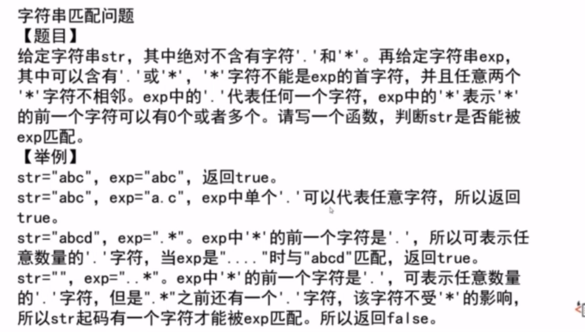
左神都被我看累了哈哈哈哈,搞一天自己推一下,理一下自己扣边界这个思路.