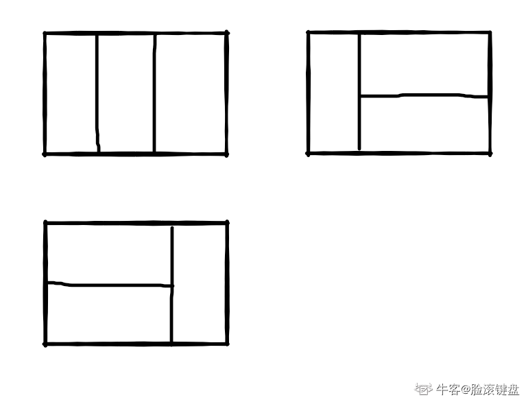

### 题目描述
我们可以用2\*1的小矩形横着或者竖着去覆盖更大的矩形。请问用n个2\*1的小矩形无重叠地覆盖一个2\*n的大矩形，总共有多少种方法？

比如n=3时，2*3的矩形块有3种覆盖方法：



> 就是斐波那契数列的变体，用递归或者动态规划

```C++
class Solution {
public:
    int rectCover(int number) {
        if(number == 1 || number == 2)
            return number;
        int *dp = new int[number]();
        dp[0] = 1;dp[1] = 2;
        for (int i = 2; i < number; ++i){
            dp[i] = dp[i - 1] + dp[i - 2];
        }
        return dp[number - 1];
    }
};

```